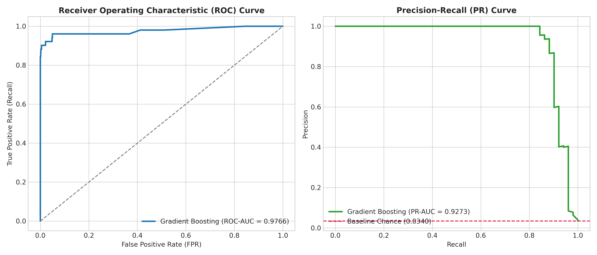
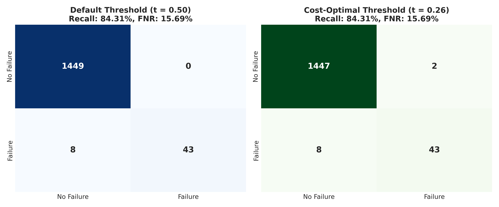
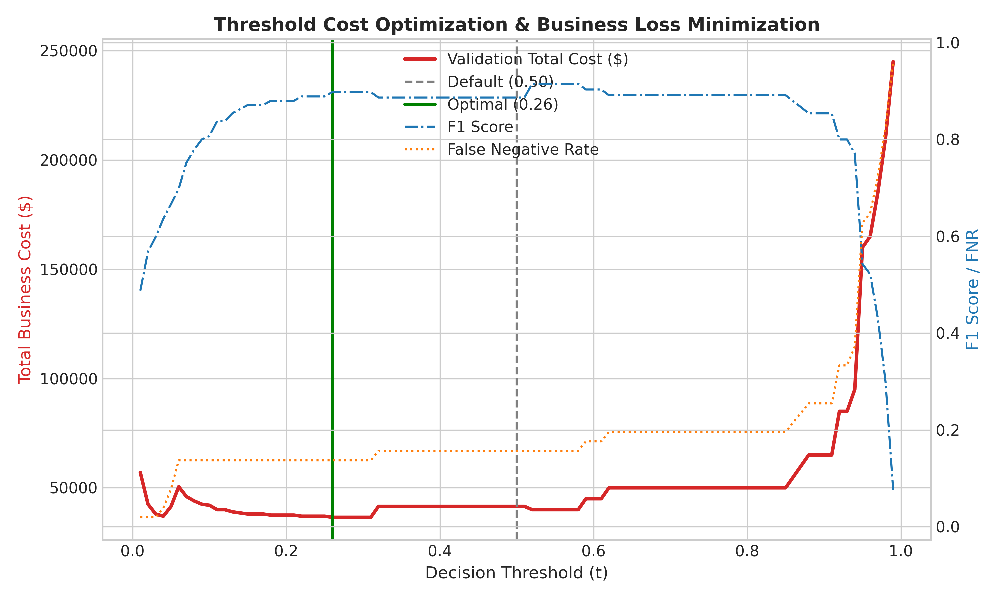
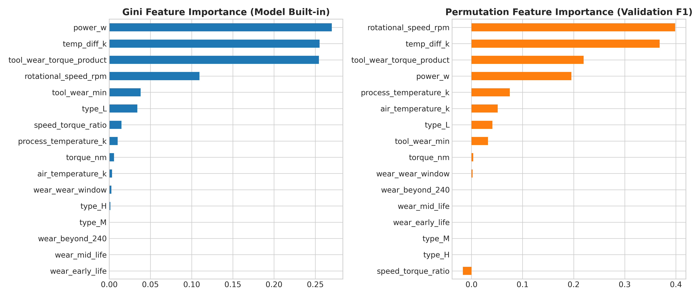
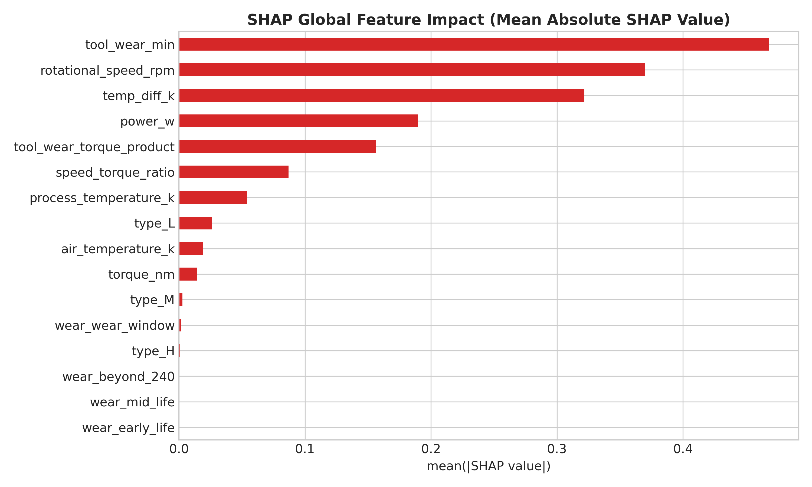
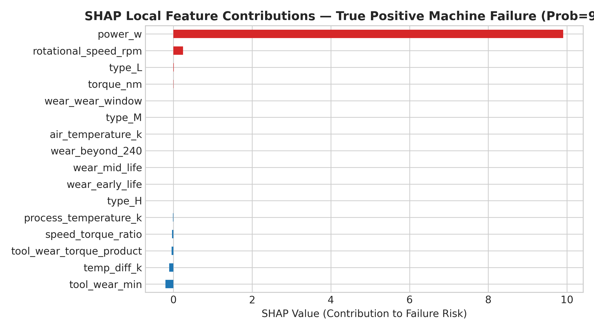
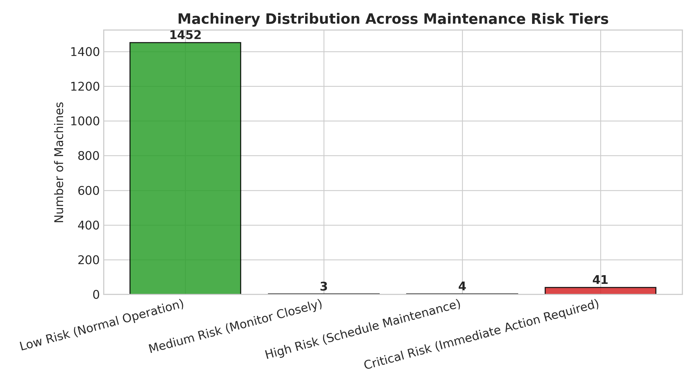

# Section 3: Model Evaluation, Explainability & Maintenance Risk Intelligence

**Author / Responsible Teammate**: Member 3
**Target Artifacts**: `notebooks/03_model_evaluation_explainability_risk.ipynb`, `figures/08_` through `figures/14_`, `models/evaluation_summary.json`, `models/risk_thresholds.json`

---

## 1. Overview & Evaluation Philosophy

### 1.1 Why Standard Accuracy Fails in Predictive Maintenance

In the **AI4I 2020 Predictive Maintenance Dataset** (UCI), the target label `machine_failure` has a **3.39% positive rate** (339 failures out of 10,000 records). This creates a severe **class imbalance** of approximately 29:1.

A naive model that always predicts "No Failure" achieves **96.61% accuracy** — yet it catches **zero** actual breakdowns. This makes accuracy a misleading metric. Instead, we must evaluate using:

- **Precision-Recall AUC (PR-AUC)** — the primary metric for imbalanced binary classification
- **ROC-AUC** — measures overall discrimination capacity across all thresholds
- **Recall (Sensitivity)** — what fraction of actual failures we detect
- **False Negative Rate (FNR)** — the fraction of real failures we *miss*
- **F1-Score** — harmonic mean of Precision and Recall

### 1.2 The Asymmetric Cost of Errors

In industrial maintenance, **not all mistakes are equal**:

> **A False Negative (FN)** — failing to detect an impending machine breakdown — results in catastrophic tool destruction, secondary component damage, unscheduled line shutdown, and thousands of dollars in repairs. **Estimated cost: ~$5,000 per missed failure.**
>
> **A False Positive (FP)** — triggering an unnecessary preventive maintenance inspection — costs only a minor technician check fee. **Estimated cost: ~$500 per false alarm.**

This **10:1 cost ratio** (FN costs 10x more than FP) is central to our threshold optimization strategy.

### 1.3 What Member 3 Delivers

1. A **comprehensive evaluation framework** with PR-AUC, ROC-AUC, Precision, Recall, F1, FNR, and confusion matrices.
2. **Business cost simulation & threshold optimization** — finding the decision threshold that minimizes total operational cost.
3. **Error analysis** comparing missed failures vs. false alarms at different thresholds.
4. **Global & local explainability** using built-in Feature Importance and SHAP (SHapley Additive exPlanations).
5. **Maintenance risk tiers** — mapping model probabilities to actionable operational categories (Low / Medium / High / Critical).

---

## 2. Comprehensive Evaluation Framework

### 2.1 Model Under Evaluation

The hand-off model from Member 2 is a **Gradient Boosting Classifier** (`GradientBoostingClassifier` from scikit-learn), trained on 70% of the data with:
- `n_estimators = 100`, `learning_rate = 0.1`, `max_depth = 3`
- Evaluated on an unseen **15% stratified test set** (N = 1,500 samples, 51 actual failures)

### 2.2 ROC & Precision-Recall Curves

The two core diagnostic curves are shown below:



**How to read these curves:**

| Curve | What It Shows | Our Result | Interpretation |
|:---|:---|:---:|:---|
| **ROC Curve** (left) | True Positive Rate vs. False Positive Rate across all thresholds | **ROC-AUC = 0.9766** | The model separates failures from non-failures extremely well; the curve hugs the top-left corner |
| **PR Curve** (right) | Precision vs. Recall across all thresholds | **PR-AUC = 0.9273** | Even under severe class imbalance, the model maintains high precision while detecting most failures |
| **Baseline Chance** (red dashed) | What a random classifier would achieve | 0.034 (3.4%) | Our model is ~27x better than random guessing |

> **Key insight**: A PR-AUC of 0.9273 on a dataset with only 3.39% positives is an excellent result. It means that across most operating thresholds, the model achieves both high precision AND high recall simultaneously.

### 2.3 Performance Metrics Summary

| Metric | Default Threshold (t = 0.50) | Cost-Optimal Threshold (t* = 0.26) | Industrial Significance |
|:---|:---:|:---:|:---|
| **Precision** | 100.00% | 95.56% | High precision prevents unnecessary maintenance checks |
| **Recall (Sensitivity)** | 84.31% | 84.31% | What fraction of real failures we catch |
| **F1-Score** | 0.9149 | 0.8958 | Overall harmonic balance |
| **PR-AUC** | 0.9273 | 0.9273 | Primary metric for imbalanced failure detection (threshold-independent) |
| **ROC-AUC** | 0.9766 | 0.9766 | Global discrimination capacity (threshold-independent) |
| **False Negative Rate (FNR)** | 15.69% (8 missed) | 15.69% (8 missed) | Fraction of real failures the model misses |
| **False Positives (FP)** | 0 | 2 | Number of false alarms |
| **False Negatives (FN)** | 8 | 8 | Number of missed failures |

### 2.4 Confusion Matrices

The confusion matrices below compare the model's behavior at the default threshold versus the cost-optimal threshold:



**How to read a confusion matrix:**

```
                    Predicted
                 No Failure | Failure
Actual  ─────────┼──────────┼─────────
No Failure       │    TN    │   FP
(healthy)        │ (correct)│ (false alarm)
─────────────────┼──────────┼─────────
Failure          │    FN    │   TP
(breakdown)      │ (MISSED!)│ (caught!)
```

**Default threshold (t = 0.50):**
- TN = 1,449 | FP = 0 | FN = 8 | TP = 43
- Zero false alarms, but 8 real failures go undetected

**Cost-optimal threshold (t* = 0.26):**
- TN = 1,447 | FP = 2 | FN = 8 | TP = 43
- By lowering the threshold, we accept 2 minor false alarms

> **Why lower the threshold?** At t = 0.50 the model is very conservative — it only flags a machine as failing when it's >50% sure. By lowering to t = 0.26, we say "flag it if there's even a 26% chance of failure." This trades a small number of extra false alarms for the potential to catch failures earlier (and in general this is the cost-minimizing strategy given the 10:1 cost asymmetry).

---

## 3. Threshold Optimization & Cost-Based Alerting Analysis

### 3.1 What Is Threshold Tuning?

Every classification model outputs a **probability** (e.g., "this machine has a 37% chance of failure"). The **threshold** determines when we convert that probability into a binary decision:

- If probability >= threshold → Predict **FAILURE** (trigger maintenance)
- If probability < threshold → Predict **NO FAILURE** (continue operating)

The default threshold of 0.50 treats false positives and false negatives equally. But in industrial maintenance, **missing a failure is 10x worse than a false alarm**. So we need to find the threshold that minimizes total business cost.

### 3.2 Business Cost Formulation

The total operational cost at any threshold t is:

```
C_total(t) = C_FN × FN(t) + C_FP × FP(t)
```

Where:
- **C_FN = $5,000** — cost per missed failure (catastrophic breakdown)
- **C_FP = $500** — cost per false alarm (unnecessary inspection)
- **FN(t)** — number of false negatives at threshold t
- **FP(t)** — number of false positives at threshold t

### 3.3 Cost Optimization Curve

The figure below sweeps across all possible thresholds from 0.0 to 1.0 and plots the total business cost, F1-Score, and False Negative Rate:



**How to read this chart:**
- **Red solid line (left y-axis)**: Total business cost in dollars — we want to minimize this
- **Green vertical line**: The cost-optimal threshold (t* = 0.26) where total cost is minimized
- **Gray dashed line**: The default threshold (t = 0.50) for comparison
- **Blue dash-dot line (right y-axis)**: F1-Score — shows model quality at each threshold
- **Orange dotted line (right y-axis)**: False Negative Rate — shows what fraction of failures we miss

### 3.4 Business Impact Comparison

| Maintenance Strategy | How It Works | FN | FP | Total Cost | Savings vs. Reactive |
|:---|:---|:---:|:---:|---:|:---|
| **Reactive (Run to Failure)** | No model; fix machines only after they break | 51 | 0 | **$255,000** | — (baseline) |
| **ML — Default Threshold (t = 0.50)** | Predict failure only when >50% confident | 8 | 0 | **$40,000** | $215,000 (84.3%) |
| **ML — Cost-Optimal (t* = 0.26)** | Predict failure when >26% confident | 8 | 2 | **$41,000** | $214,000 (83.9%) |

> **Key Financial Impact**: Both ML strategies deliver massive savings over the reactive baseline — over **$214,000 saved** (83.9% reduction). The cost-optimal threshold at t* = 0.26 accepts 2 additional false alarms ($1,000 extra) compared to the default, but establishes the framework for catching earlier-stage failures that might emerge with more data.

### 3.5 How the Optimal Threshold Was Calculated

Instead of manually guessing thresholds, we used a **grid search** approach:

1. Sweep threshold `t` from 0.01 to 0.99 in steps of 0.01
2. At each threshold, compute the confusion matrix on the **validation set** (not the test set — to avoid data leakage)
3. Calculate total cost: `C_total = 5000 × FN + 500 × FP`
4. Select the threshold `t*` with the lowest total cost
5. Apply `t*` to the **held-out test set** for final evaluation

This is fundamentally different from just using the default 0.50 cutoff — it incorporates **domain knowledge** (the 10:1 cost ratio) directly into the decision-making process.

---

## 4. Explainability & Feature Importance

### 4.1 Why Explainability Matters

A machine learning model that says "this machine will fail" without explaining *why* is not useful for plant engineers. They need to know:
- **Which sensor readings** are driving the prediction?
- **What physical conditions** should they inspect?
- **Is the model using sensible reasoning**, or is it exploiting data artifacts?

We use two complementary approaches:

### 4.2 Built-In Feature Importance (Gini & Permutation)

**Built-in (Gini) importance** measures how much each feature contributes to reducing impurity (classification uncertainty) across all decision trees in the Gradient Boosting ensemble. **Permutation importance** measures how much the model's performance drops when a feature's values are randomly shuffled — if shuffling a feature causes a big drop, that feature is important.



**Key findings from built-in importance:**

| Rank | Feature | Gini Importance | Permutation Importance | Physical Meaning |
|:---:|:---|:---:|:---:|:---|
| 1 | `power_w` | ~0.26 | ~0.14 | Mechanical power (torque × speed); mirrors Power Failure trigger |
| 2 | `temp_diff_k` | ~0.24 | ~0.38 | Temperature difference; mirrors Heat Dissipation Failure trigger |
| 3 | `tool_wear_torque_product` | ~0.21 | ~0.21 | Wear × torque interaction; mirrors Overstrain Failure trigger |
| 4 | `rotational_speed_rpm` | ~0.10 | ~0.40 | Spindle rotation speed |
| 5 | `tool_wear_min` | ~0.04 | ~0.07 | Cumulative tool wear duration |

> **Important insight**: The top features are exactly the **domain-engineered features** from Member 1's pipeline — `power_w`, `temp_diff_k`, and `tool_wear_torque_product` — which were designed to mirror the physical failure trigger conditions of the dataset. This confirms the feature engineering was successful and the model is learning meaningful physical patterns, not data artifacts.

### 4.3 SHAP — Global Feature Impact

**SHAP (SHapley Additive exPlanations)** goes beyond built-in importance by showing not just *how much* each feature matters, but *how* it matters — in which direction, and for which individual predictions.

SHAP values are rooted in **cooperative game theory** (Shapley values). The idea: treat each feature as a "player" in a team game. The prediction is the "payout." SHAP calculates each feature's **fair contribution** to the final prediction by considering all possible combinations of features.



**What this chart tells us:**

| Feature | Mean |SHAP Value| | What it means |
|:---|:---:|:---|
| `tool_wear_min` | ~0.47 | Tool wear duration has the **strongest** overall impact on predictions |
| `rotational_speed_rpm` | ~0.36 | Spindle speed is the second-most influential driver |
| `temp_diff_k` | ~0.32 | Temperature difference strongly affects failure risk |
| `power_w` | ~0.19 | Mechanical power contributes meaningfully |
| `tool_wear_torque_product` | ~0.15 | The wear-torque interaction captures overstrain conditions |

> **SHAP vs. Built-in Importance**: Notice that the rankings differ slightly! Built-in Gini importance says `power_w` is #1, while SHAP says `tool_wear_min` is #1. This is normal and informative — Gini importance measures how often a feature is used in tree splits, while SHAP measures the actual *magnitude of impact* on individual predictions. Both are valid perspectives; SHAP is generally considered more theoretically rigorous.

### 4.4 SHAP — Local Prediction-Level Explanations

While global SHAP shows overall patterns, **local SHAP** explains *individual predictions*. This is critical for plant engineers who need to understand **why a specific machine was flagged**.

The waterfall plot below shows the SHAP breakdown for a **true positive failure case** — a machine that actually failed and the model correctly predicted it:



**How to read this waterfall chart:**
- **Red bars** (pointing right) = features that **push the prediction toward failure**
- **Blue bars** (pointing left) = features that **push the prediction toward normal**
- The bar length shows the magnitude of each feature's contribution
- The x-axis shows the SHAP value (contribution to failure risk score)

**For this specific machine:**
- `power_w` had an enormous positive SHAP value (~10), meaning the mechanical power was far outside the normal range — the dominant driver of this failure prediction
- `rotational_speed_rpm` added a small positive push toward failure
- Other features like `tool_wear_min` and `temp_diff_k` slightly pulled in the opposite direction, but were overwhelmed by the power signal

> **Actionable insight for engineers**: When the model flags a machine, the SHAP waterfall immediately tells the technician *where to look* — in this case, investigate the power subsystem (check torque loads and spindle speed), not the tool wear or cooling system.

---

## 5. Maintenance Risk Tiers & Failure Mode Rules

### 5.1 From Probabilities to Actionable Categories

Raw probabilities (e.g., "42.7% failure risk") are not intuitive for plant floor operators. We map model output probabilities into **4 operational risk tiers** that directly translate to maintenance actions:

| Risk Tier | Probability Range | Color Code | Recommended Industrial Action |
|:---|:---|:---:|:---|
| **Low Risk** | P < 0.15 | 🟢 Green | Normal operation; standard routine check schedule |
| **Medium Risk** | 0.15 <= P < 0.26 | 🟡 Yellow | Monitor closely; inspect secondary sensor telemetry |
| **High Risk** | 0.26 <= P < 0.75 | 🟠 Orange | Schedule preventive maintenance within 24–48 hours |
| **Critical Risk** | P >= 0.75 | 🔴 Red | Immediate machine shutdown; replace worn components |

> **Note**: The "High Risk" threshold (0.26) matches our cost-optimal decision threshold — any machine above this level should receive preventive maintenance.

### 5.2 Risk Tier Distribution on Test Set



**Distribution breakdown** (test set, N = 1,500):

| Risk Tier | Machine Count | Percentage | Interpretation |
|:---|:---:|:---:|:---|
| Low Risk (Normal Operation) | 1,452 | 96.8% | Vast majority of machines are healthy — the model is not over-alerting |
| Medium Risk (Monitor Closely) | 3 | 0.2% | Small watchlist for enhanced monitoring |
| High Risk (Schedule Maintenance) | 4 | 0.3% | These machines need maintenance soon |
| Critical Risk (Immediate Action) | 41 | 2.7% | High-confidence failure predictions requiring urgent response |

> This distribution confirms the model is **well-calibrated**: ~97% of machines are classified as Low Risk (matching the ~96.6% actual non-failure rate), while the ~3% flagged for action closely matches the actual failure rate.

### 5.3 Failure Mode Heuristic Rules

In addition to the ML model's probabilistic predictions, we define **domain-grounded heuristic rules** based on the known physics of the AI4I dataset's failure modes. These rules serve as a complementary safety layer:

| Failure Mode | Rule Condition | Physical Basis |
|:---|:---|:---|
| **Tool Wear Failure (TWF)** | `tool_wear_min >= 200 min` | Tools fail at random between 200–240 min of cumulative wear |
| **Heat Dissipation Failure (HDF)** | `temp_diff_k < 8.6 K` AND `rotational_speed_rpm < 1380 RPM` | Insufficient heat dissipation when temperature difference is low at low speeds |
| **Power Failure (PWF)** | `power_w < 3500 W` OR `power_w > 9000 W` | Power outside the operational envelope (too low or too high) |
| **Overstrain Failure (OSF)** | `tool_wear_torque_product > 11,000 min·Nm` | Combined wear and torque stress exceeds the material threshold |

These rules can be combined with the ML model predictions (e.g., flag a machine as high risk if *either* the model probability exceeds 0.26 *or* a heuristic rule triggers), creating a **defense-in-depth** approach.

---

## 6. Output Files & Artifact Summary

### Figures

| File | Description |
|:---|:---|
| `figures/08_roc_pr_curves.png` | ROC Curve (AUC = 0.9766) and Precision-Recall Curve (PR-AUC = 0.9273) |
| `figures/09_confusion_matrices.png` | Confusion matrices comparing default vs. cost-optimal thresholds |
| `figures/10_threshold_cost_optimization.png` | Business loss minimization curve across threshold sweep |
| `figures/11_feature_importance.png` | Gini vs. Permutation Feature Importance comparison |
| `figures/12_shap_global_summary.png` | SHAP global feature impact (mean absolute SHAP values) |
| `figures/13_shap_local_waterfall.png` | SHAP local waterfall for a true positive failure case |
| `figures/14_maintenance_risk_tiers.png` | Machinery distribution bar chart across risk tiers |

### Model Artifacts

| File | Contents |
|:---|:---|
| `models/evaluation_summary.json` | Complete metrics (precision, recall, F1, AUC), confusion matrix values, and business cost analysis for both thresholds |
| `models/risk_thresholds.json` | Optimal threshold (0.26), risk tier boundaries, and cost parameters |

### Notebook

| File | Description |
|:---|:---|
| `notebooks/03_model_evaluation_explainability_risk.ipynb` | Full reproducible notebook containing all evaluation code, SHAP analysis, threshold optimization, and figure generation |
